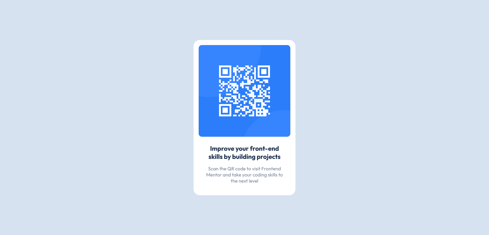

# Frontend Mentor - QR code component solution

This is a solution to the [QR code component challenge on Frontend Mentor](https://www.frontendmentor.io/challenges/qr-code-component-iux_sIO_H). Frontend Mentor challenges help you improve your coding skills by building realistic projects. This project was made by WhaleWellWell!

## Table of contents

- [Frontend Mentor - QR code component solution](#frontend-mentor---qr-code-component-solution)
  - [Table of contents](#table-of-contents)
  - [Overview](#overview)
    - [Screenshot](#screenshot)
    - [Links](#links)
  - [My process](#my-process)
    - [Built with](#built-with)
    - [What I learned](#what-i-learned)
    - [Continued development](#continued-development)
    - [Useful resources](#useful-resources)
  - [Author](#author)

## Overview

### Screenshot

Destop view of component:

### Links

- Solution URL: [On Github](https://github.com/WhaleWellWell/QR-Code-Component-Challenge)
- Live Site URL: [On Netlify](https://whalewellwell-qrcomponent.netlify.app/)

## My process

### Built with

- HTML5 markup
- CSS variables and Flexbox
- I was going to use sass but decided not to.

### What I learned

I am still learning flexbox so this helped me use it in a practical way. This project is pretty simple so it was easy enough.

### Continued development

I think this component is pretty much finished, exept if anyone has any suggestions I can impliment them.

### Useful resources

- [Stack Overflow](https://stackoverflow.com/) - This helped me because I am still learning flexbox and needed clarification on some properties.

## Author

- Codepen - [WhaleWellWell](https://codepen.io/WhaleWellWell)
- Frontend Mentor - [WhaleWellWell](https://www.frontendmentor.io/profile/WhaleWellWell)
- WebDeveloper.com - [WhaleWellWell](https://webdeveloper.com/@WhaleWellWell/)
